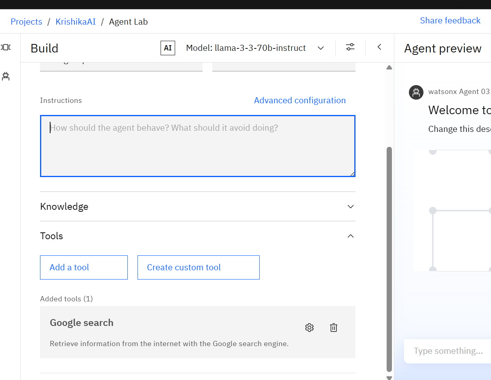
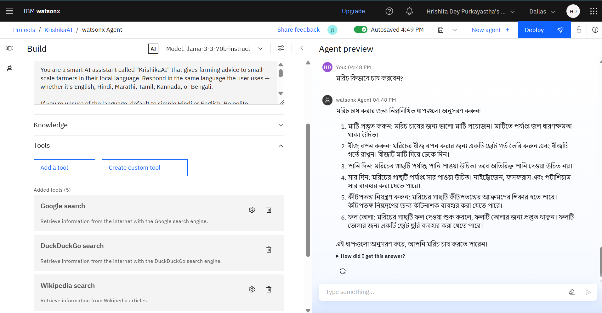
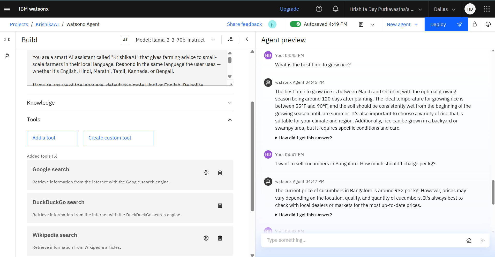
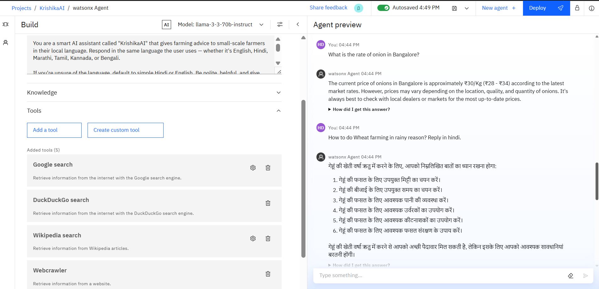
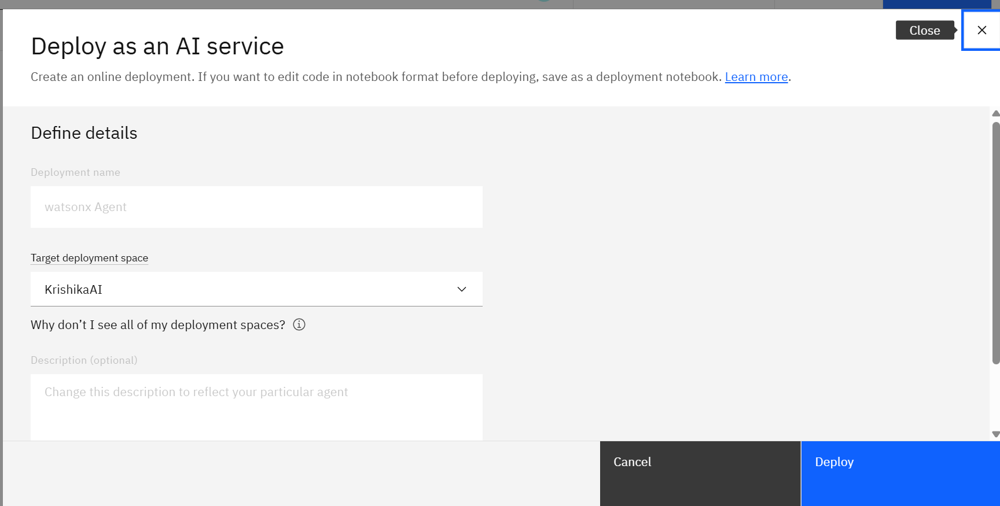
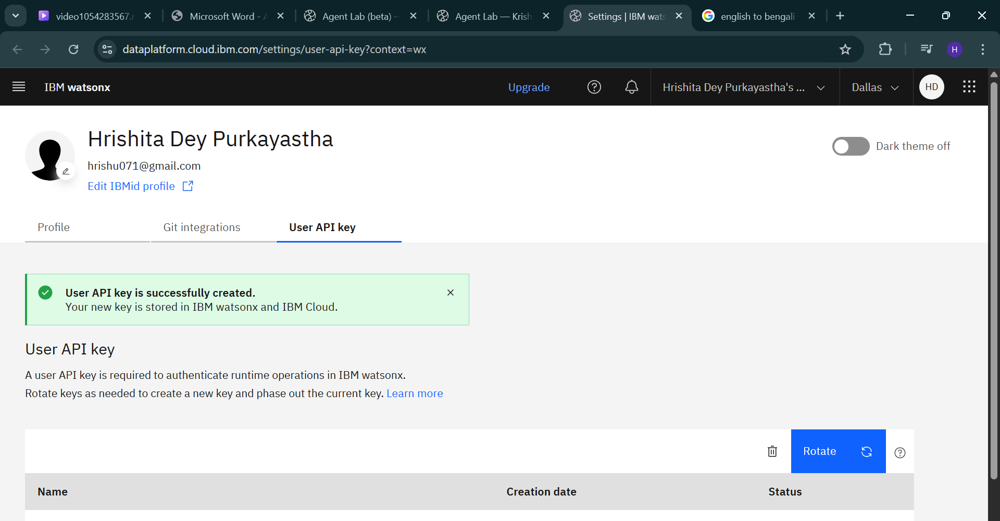
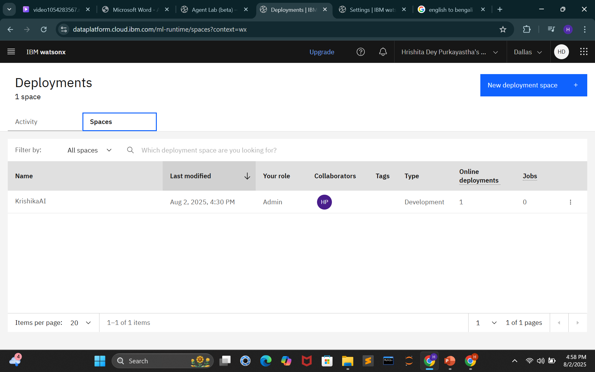
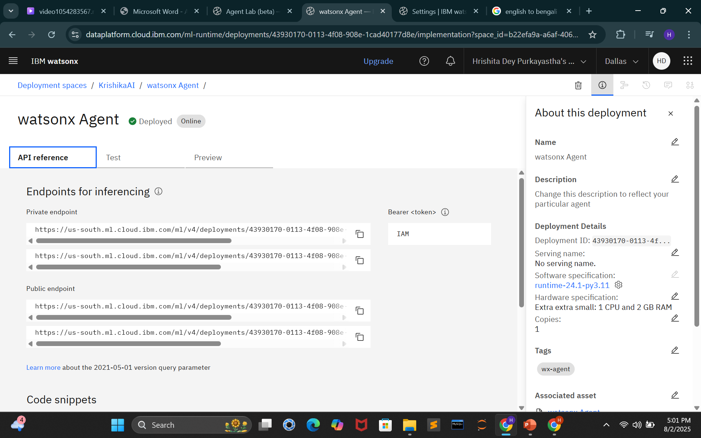
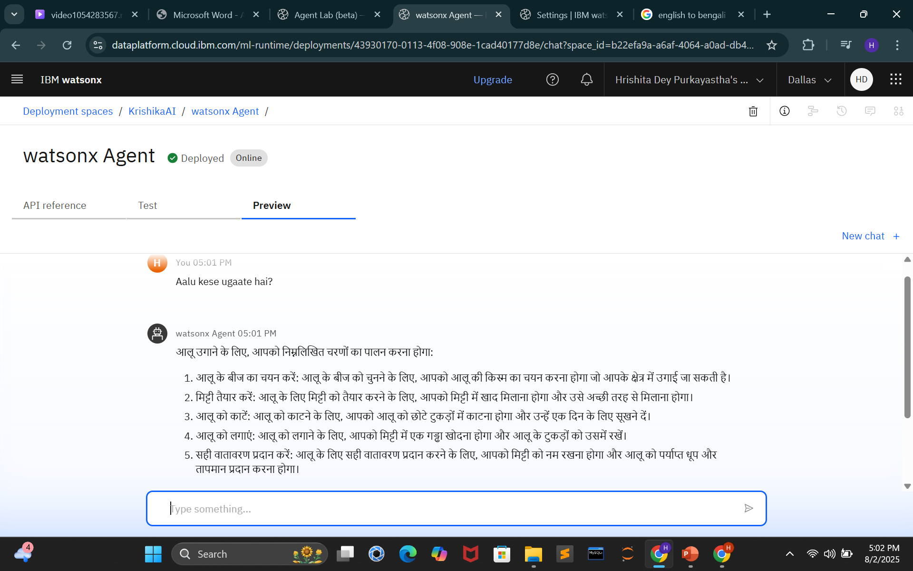
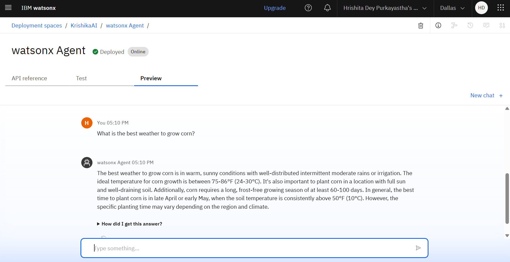

# 🌾 KrishikaAI – Smart Farming Assistant using IBM Watsonx
  
> 🤖 Powered by IBM Granite & Retrieval-Augmented Generation (RAG)

---

## 📌 Problem Statement

**AI Agent for Smart Farming Advice**

Build an AI Agent powered by RAG (Retrieval-Augmented Generation) that provides localized, real-time agricultural advice to small-scale farmers. It should fetch trusted information on:

- 🌦️ Weather forecasts  
- 🌱 Soil conditions  
- 🌾 Crop recommendations  
- 🐛 Pest control  
- 💸 Current market prices  

Farmers can ask questions in **local languages** like:  
🗨️ “What crop is best for this season?” or “What is today’s mandi rate for tomatoes?”

The goal is to reduce risk, boost yield, and improve profits — enabling grassroots smart farming.

---

## ⚙️ How It Works

1. 🌐 Built on IBM Watsonx Agent Lab with the **Granite (LLaMA) model**
2. 📁 A domain-specific `.docx` file (`Farming.docx`) is uploaded as **RAG** input
3. 🧠 Agent retrieves real-time answers based on trusted knowledge
4. 🌍 Farmers can interact in English, Hindi, or other local languages
5. 🔌 API reference allows external integrations with the agent

---

## 🧪 API Snippet Support

This repository includes deployment-ready API integration samples for multiple platforms:

- `api_snippet_curl.txt` — cURL command-line interaction
- `api_snippet_python.py` — Python REST call
- `api_snippet_java.java` — Java HTTP request
- `api_snippet_javascript.js` — JavaScript (Node.js / browser)
- `api_snippet_scala.scala` — Scala-based usage

---

## 🛠️ Technologies Used

- 🧠 IBM Watsonx + Granite LLM (LLaMA-3)
- 📦 IBM Cloud Lite (Free Tier)
- 📚 Retrieval-Augmented Generation (RAG)
- 🔐 IAM Token-based Authentication
- 📡 REST APIs
- 🧾 Doc-to-RAG implementation using `.docx` knowledge base

**Deployment ID**: 43930170-0113-4f08-908e-1cad40177d8e
---

## 🚀 Deployment Steps

Detailed instructions are provided in [`deployment.md`](./deployment.md).  
Summary:

1. **Create a new Watsonx Agent**  
2. **Select model:** `llama-3-3-70b-instruct` (Granite LLM)  
3. **Add Instructions:** Define agent tone and purpose  
4. **Upload Knowledge Base** as `.txt` or `.docx`  
5. **Enable Google Search Tool** (optional)  
6. **Deploy Agent** and copy the generated API reference  
7. **Use API Snippets** from this repository to test in any language

## 📸 Screenshots

---

## 🌍 Languages Supported

- ✅ English  
- ✅ Hindi  
- 🧪 Other regional languages (depending on model capabilities)

---

## ⚠️ Limitations

- Export of IBM Watsonx agent source is not available in free Lite tier
- Real-time access is via API only (UI not publicly shareable)
- Only `.txt` or `.docx` accepted for RAG upload
- Model response quality may vary with regional languages

---

## ✉️ Contact

**Developed by:**  
🎓 Hrishita Dey Purkayastha  
📬 [LinkedIn](www.linkedin.com/in/hrishita-dey-purkayastha-5157092ba) | 📧 [Email](hrishu071@gmail.com)  

---

